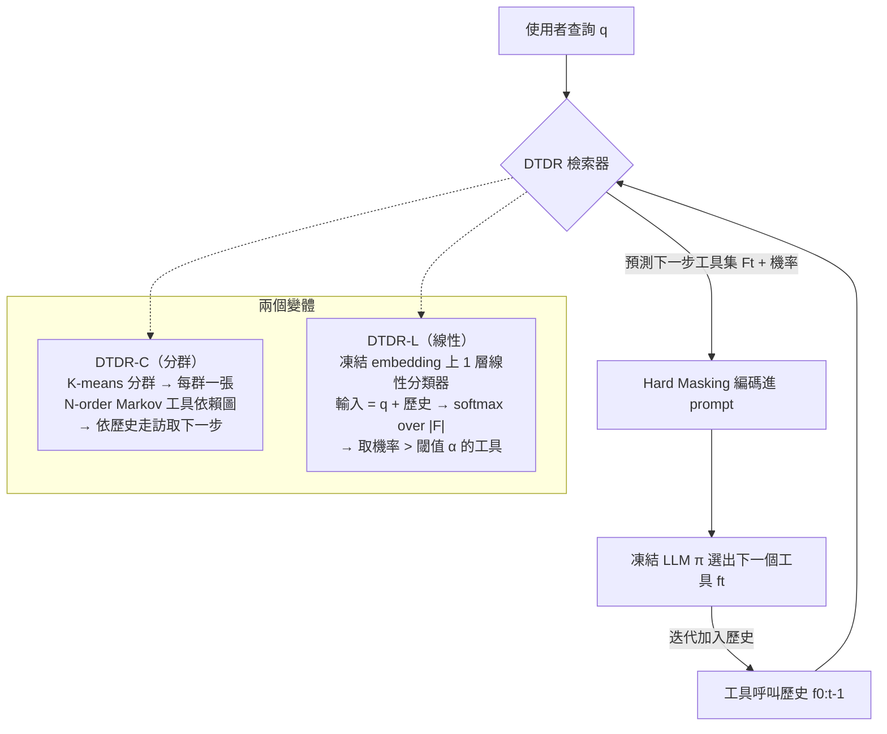

# DTDR：Dynamic Tool Dependency Retrieval for Lightweight Function Calling — 完整整理

> **論文**：Dynamic Tool Dependency Retrieval for Lightweight Function Calling
> **arXiv**：[2512.17052v4](https://arxiv.org/abs/2512.17052)（cs.LG，2026-04-17 v4）
> **作者**：Bhrij Patel\*（UMD，實習於 Qualcomm）, Davide Belli\*, Amir Jalalirad, Maximilian Arnold, Aleksandr Ermolov, Bence Major（\* 共同一作）
> **單位**：**Qualcomm AI Research**、University of Maryland College Park
> **方法簡稱**：**DTDR**（Dynamic Tool Dependency Retrieval），兩個變體 **DTDR-C**（分群）、**DTDR-L**（線性分類器）

> 本文件依 v4 PDF 原文逐節整理，公式（Eq.1–2）、Algorithm 1–7、Table 1–7 與各圖結論均取自原文。
> **特別加強第 10 節「詳細實驗步驟 + 如何判定『合格 / 正確 tool』」**（依使用者要求）。

---

## 1. 一句話總結（TL;DR）

> **DTDR 解決「端側（on-device）函式呼叫代理」的工具檢索問題**：傳統檢索只看「查詢 query」或「最近一次工具呼叫」是**靜態**的，會把不相關工具塞進 prompt 誤導小模型。DTDR 改成**同時條件化於「使用者查詢 q」與「不斷增長的工具呼叫歷史 f₀:ₜ₋₁」**，動態檢索出「對當前任務＋當前軌跡都嚴格相關」的最小工具依賴子集，再以 **Hard Masking** 編碼進 prompt。
> 兩個輕量變體：**DTDR-C**（K-means 分群 + N-order Markov 工具依賴圖）與 **DTDR-L**（凍結 embedding 上的 1 層線性分類器）。相對 SOTA 靜態檢索器，**函式呼叫成功率提升 23%–104%**，同時**縮短 prompt 最多 73%**，適合手機端。

---

## 2. 研究背景與動機

### 2.1 端側函式呼叫的兩大限制
- LLM + 工具使用（function calling）已從早期神經符號系統演進到能 plan/select/invoke API 的 agentic 框架。
- 但**端側部署**受兩大限制：(i) **嚴格的記憶體/延遲預算**（要輕量）；(ii) 要能應付**大量且異質的工具集**。

### 2.2 既有工具檢索的問題
- 為了不把上百個工具全塞進 prompt，先用**工具檢索模組**只選相關工具 → 提升準確率、縮短 prompt。
- 但「**該用什麼資訊來引導檢索**」是關鍵難題：
  - **只靠語意相似度**（query ↔ 工具描述）：忽略多步計畫中「已選工具的歷史」。
  - **靜態工具依賴圖**（只看最近一次呼叫 fₜ₋₁，一階 Markov）：
    - **偏向重複呼叫**：例如 `P(getEmailAddress | getEmailAddress)` 在「寄給多人」的示範中很高，會誤導 agent 不必要地重複呼叫。
    - **欠擬合任務**：跨各種查詢統計的機率，無法區分「單一收件人 vs 多收件人」。
    - **抓不到分支依賴**：`open_file → summarize_pdf` 之後該做什麼，取決於任務意圖（附筆記 / 寄信 / 其他檔案操作）；一階模型把所有後續混在一起，候選集過寬、缺乏任務特異精度。

### 2.3 核心問題
> 一個好的工具檢索器必須**同時適應「當前任務」與「進行中的軌跡」**，又要**夠輕量**能跑在端側。
> → 能不能用「低資源」方式達到這種「任務 + 歷史」雙重特異性？這就是 DTDR 要回答的。

---

## 3. 問題形式化（原文 §3）

- **代理 π**：含一個**凍結的 LM**。`F` = 可選的所有函式名集合；`q` = 自然語言查詢（如 "Reply to my latest email from Willem."）。
- `f₀:ₜ₋₁ = [f₀,…,fₜ₋₁]` = 到時刻 `t` 為止已預測的函式序列。`q, f₀:ₜ₋₁, F` 編碼進 prompt `p`，agent 取樣 `fₜ ∼ π(·|p)`。
- **正確性定義**：`fₜ` 正確 ⟺ `fₜ ∈ F*ₜ`，`F*ₜ` 是「`q` 在時刻 `t` 的**正確函式集合**」（注意是「集合」——同一步可能有多個可接受工具）。
- **檢索模組 `ω(·)`**：輸出工具子集 `Fₜ ⊆ F` 編入 prompt 以提高正確機率；不同方法的輸入不同。
- **最佳化目標（Eq.1）**：在所有可能檢索器 `Ω` 中最大化每步選對的期望：

$$\max_{\omega\in\Omega}\ \sum_{q\in Q}\sum_{t=0}^{T}\ \mathbb{E}_{f_t\sim\pi(\cdot|p)}\big[\mathbb{1}_{f_t\in F^*_t}\big]$$

- **最佳檢索器 `ω*`**：檢索出的集合是 ground-truth 集合的**非空子集**：`{} ⊂ ω*(·) = Fₜ ⊆ F*ₜ`（即「只檢索正確工具、且至少檢索到一個」）。
- **設定**：execution-free / offline 的**規劃階段**評測（agent 先做完整 plan 再執行），符合 IDE 助手、工作流自動化、企業 copilot 等真實情境——規劃時選錯工具會導致不必要執行與昂貴重規劃。

---

## 4. 相關工作與定位（原文 Table 1：5 項條件）

DTDR 是**唯一同時滿足 5 項條件**的方法：

| 方法 | 工具依賴感知 | 免工具描述 | 查詢感知 | 多步歷史感知 | 小模型可用 |
|---|:--:|:--:|:--:|:--:|:--:|
| BM25 | ✗ | ✗ | ✓ | ✗ | ✓ |
| ToolGraph Retriever (Gao 2025) | ✓ | ✗ | ✓ | ✗ | ✗ |
| Less-is-More Lv1 (2025) | ✗ | ✗ | ✓ | ✗ | ✓ |
| ToolNet (Liu 2024a) | ✓ | ✓ | ✗ | ✗ | ✓ |
| TinyAgent (Erdogan 2024) | ✗ | ✓ | ✓ | ✗ | ✓ |
| Toolformer (Schick 2023) | ✗ | ✓ | ✓ | ✗ | ✓ |
| **DTDR（本文）** | **✓** | **✓** | **✓** | **✓** | **✓** |

5 項條件含義：① 依賴感知（多步任務更佳）；② 免依賴工具文件（大工具集文件可能缺/不一致）；③ 查詢感知（email 任務該檢索 email 相關工具）；④ 多步歷史感知（避免偏向高頻函式）；⑤ 小模型（端側記憶體/延遲）。

---

## 5. 方法：Dynamic Tool Dependency Retrieval（原文 §4）

**核心想法**：檢索器同時條件化於任務 `q` 與歷史 `f₀:ₜ₋₁`，即 `ω(q, f₀:ₜ₋₁)`。預測一組工具 `Fₜ` 並給每個工具一個機率，再以 **Hard Masking** 把 `F` 中未檢索到的工具排除、並附上檢索工具的機率，餵給凍結 LLM 取樣 `fₜ`。端到端時從空計畫開始迭代，直到預測出 "end-of-plan"。

兩個輕量變體（皆使用示範資料 `D`）：

### 5.1 DTDR-C（Clustering，無監督）
- **分群元件**：用預訓練 embedding 把示範查詢 `Q_D` 編碼，擬合 **K-means**（群數 `K`）。`β` = `q` 的 embedding。第 `k` 群的示範集 `D_k = {d | C(β)=k}`。
- **圖走訪元件**：每群建一張**加權工具依賴圖 `G_k`**（描述「給定一段工具歷史後、下一個工具的機率分佈」，即 **l-order Markov chain**）。
- 測試時：`Fₜ = G_{C(β)}(f₀:ₜ₋₁)`——先用查詢找最近群，再用歷史在該群的圖上走訪取下一步工具分佈。
- **參數量**：`e × K`（`e`=embedding 維度，`K`=群數）。**最佳群數 ≈ 訓練集大小的 1/10**。
- **靜態 DR = DTDR-C 設 K=1、N=1**（退化成全域一階 Markov）。

### 5.2 DTDR-L（Linear，有監督）
- 在**凍結 embedding 模型**上訓練 **1 層線性分類器 `ϕ`**，輸入 `ζ = embedding(q + f₀:ₜ₋₁)`（`+` 為字串串接），softmax 得各函式機率 `ϕ(ζ)`。
- **檢索**：設閾值 `α`，`Fₜ = {f | f∈F, ϕ(ζ) > α}`。
- **參數量**：`e × |F|`（只看 embedding 維度與工具數）。
- **訓練（Eq.2）**：逐步（per-step）訓練，對每個查詢、每個時刻 `t`、每個函式 `f` 用 **|F| 個獨立 BCE 損失之和**；`f` 為正樣本 ⟺ `f ∈ F*_{q,t}`：

$$\phi^*=\arg\min_{\phi}\ -\sum_{q\in Q_{train}}\sum_{t=0}^{T}\sum_{f\in F}\big(\mathbb{1}_{f\in F^*_{q,t}}\big)\log\phi(q,d_{0:t-1})$$

- **靜態 LR = DTDR-L 只用查詢輸入**（不含歷史，整個任務開頭算一次）。

### 5.3 把 `Fₜ` 編入 prompt 的 ICL 策略（原文 §5）
| 策略 | 說明 |
|---|---|
| **No ICL** | 只給 1 個隨機示範（示意如何完成任務）。 |
| **Raw Demonstrations** | 額外給最多 5 個「計畫包含被檢索工具」的完整示範（吃 token、prefill 慢）。 |
| **Hard Mask** | **完全排除**未檢索到的工具，prompt 只留檢索子集。 |
| **Soft Mask** | 全部工具都列出，但**強調**檢索子集為「應優先選用」。 |
| **Weighted 變體** | 把檢索器給的機率分數也編入（Hard/Soft 各有 weighted 版）。 |
- **最佳**：一般以 **Weighted Hard Masking** 為首選；但當**測試與示範資料分布差異大**（預測機率不準）時，**unweighted** 反而較好。

---

## 6. 如何實作（原文 Algorithm 1–7 重點）🛠️

> 作者未釋出程式碼，但提供完整 pseudocode（Appendix I）。以下為各演算法重點。

**Algorithm 1 — 端到端「函式選擇軌跡」**：從空歷史開始，迴圈：取 `func_history = T[:iter]` → 用檢索器得 `ω` → 用 Function Selection Prompt + ICL 組 prompt → `next_func = M(p)` → 加入軌跡，直到 "end" 或達 MAX_ITERS。

**Algorithm 2 — 參數填充（Parameter Filling）**：對選定的每個函式，用其簽章（參數名/型別/約束）+ 查詢，讓**同一個 LLM** 預測參數。

**Algorithm 3 — 建 N-order Markov 工具依賴圖**：對每條示範軌跡用長度 `l` 的**滑動窗**，把「窗內歷史 tuple `T`」→「下一函式 `s`」計次，最後每個 `T` 的分佈正規化到和為 1（不足 `l` 用 `'start'` 左補）。例：`G6` 給定長度 6 的歷史 → 下一工具機率分佈（見原文 Table 6）。

**Algorithm 4 — DTDR-C**：`E(q)` → 找最近群 → 蒐集該群示範 → 建 N-order Markov 圖 → `ω = G[tuple(func_history)]`。

**Algorithm 5 — 訓練 DTDR-L 線性層**：對每個 (查詢, 示範軌跡)、每個時刻，`x = q + 歷史` → `E(x)` → softmax → 用 Eq.2 訓練。

**Algorithm 6 — DTDR-L 推論**：`x = q + func_history` → `E(x)` → `ϕ` softmax → 取 `softmax > α` 的函式入 `ω`，正規化。

**Algorithm 7 — QTS baselines**：（vanilla / Less-is-More / Tool Graph Retriever）只在**任務開頭算一次**、整個任務固定。對工具描述做 embedding，與查詢（或 LLM 改寫後的「理想工具描述」）算 **cosine 相似度**，取 `> α`；Tool Graph Retriever 再用依賴圖 `GT`（N=1,K=1）對描述 embedding 做卷積更新。

---

## 7. 實驗設定（原文 §5 與 Appendix B/C/D）

### 7.1 四個函式呼叫資料集（Table 5 統計）
| 資料集 | #計畫 | #工具 | 每計畫工具呼叫數 | **每計畫工具依賴數** |
|---|---|---|---|---|
| TinyAgent | 39,874 | 17 | 4.5 ± 1.9 | **1.9 ± 1.8** |
| TaskBench DailyLife (TB-DL) | 3,860 | 41 | 4.1 ± 1.7 | **0.1 ± 0.2**（幾乎無依賴） |
| TaskBench HuggingFace (TB-HF) | 4,959 | 24 | 3.2 ± 1.5 | **1.1 ± 1.5** |
| TaskBench Multimedia (TB-MM) | 4,310 | 41 | 3.6 ± 1.7 | **1.5 ± 1.7** |
- 「工具依賴」= 某函式呼叫的**參數是計畫中較早函式的輸出**。TB-DL 幾乎都是不相關的平行呼叫 → 依賴建模對它幫助小（重要對照）。
- **切分**：每個資料集留 ~**30% 作測試**，其餘作示範軌跡（檢索器與 ICL 用）；並確保每個工具在 train/test 維持 **70/30** 出現比例。

### 7.2 LLM backbones（7 個）
- **Qwen 3**：0.6B / 1.7B / 4B / 8B / 14B（代表不同尺寸端側裝置；INT4 + 10k KV cache 下，**≤ Qwen3-4B 可順跑於一般手機**）。
- **GPT-4o**（雲端，API）。
- **Gorilla-V2**（端側、針對 function calling 微調的模型）。

### 7.3 指標（4 個；定義詳見第 10 節）
- 檢索：**MRR**（排序）、**F1**（集合）。
- 下游：**FSA**（Function Selection Accuracy，函式選擇正確率）、**SR**（Success Rate，端到端成功率，含參數）。
- 效率：**prompt 長度**（prefill 速度代理）、**參數量**（端側佔用）。

### 7.4 baselines（依 Table 1 類別）
- **BM-25**（詞相似）；**QTS**（Query-Tool Similarity，句向量；含 Vanilla、Less-is-More Lv1、Tool Graph Retriever）；**LR**（Learned Retriever，TinyAgent）；**DR**（Dependency Retriever，ToolNet，靠最近一次呼叫）。皆**不**用執行回饋。

### 7.5 超參數 / 硬體
- 共用句向量模型 **paraphrase-MiniLM-L6-v2**（維度 **384**）。
- **DTDR-L 訓練**：Adam，lr=1e-3，lr decay 0.9，weight decay 1e-5，10 epochs。
- **DTDR-C**：群數 = 訓練集 1/10；歷史/階數最佳 `l=3`。
- 其餘檢索器掃 **閾值 α ∈ {0.2, 0.23, 0.5}**，依 FSA 設定（**DTDR-C 不需閾值**）。
- ICL 用 greedy 解碼；Qwen/Gorilla 用 FP16，GPT-4o 走雲 API；**NVIDIA A100** 上跑。

---

## 8.（已併入第 10 節）

---

## 9. 主要結果（原文 §6）

### 9.1 檢索 + 函式選擇（Table 2，Qwen3-0.6B，Hard Masking）
| 方法（類別） | TinyAgent FSA/MRR/F1 | TB-HF FSA/MRR/F1 | TB-MM FSA/MRR/F1 |
|---|---|---|---|
| Random Guess | 5.9 / .26 / .12 | 4.2 / .16 / .05 | 2.4 / .11 / .03 |
| BM-25 | 23.1 / .35 / .20 | 8.3 / .18 / .05 | 13.7 / .26 / .19 |
| QTS (Vanilla) | 15.8 / .26 / .14 | 7.9 / .21 / .08 | 5.3 / .14 / .04 |
| QTS (Gao 2025) | 21.5 / .18 / .09 | 14.6 / .37 / .27 | 5.3 / .14 / .20 |
| QTS (Param. 2025) | 23.7 / .36 / .19 | 12.9 / .30 / .18 | 7.6 / .29 / .18 |
| DR (ToolNet) | 30.7 / .70 / .49 | 17.1 / .46 / .33 | 13.3 / .38 / .27 |
| **DTDR-C（本文）** | **43.3 / .78 / .56** | 27.5 / .64 / .55 | 24.4 / .52 / .43 |
| LR (TinyAgent) | 25.6 / .53 / .39 | 20.5 / .53 / .32 | 21.0 / .49 / .28 |
| **DTDR-L（本文）** | **65.1 / .93 / .55** | **27.8 / .75 / .63** | **27.0 / .69 / .55** |

（TB-DL 見 Table 7：DTDR-L 58.9/.85/.64 vs LR 23.6/.55/.44、DTDR-C 28.2/.54/.29。）

- **DTDR-L 相對靜態 LR**：TinyAgent、TB-DL 提升 **> 35%**；TB-HF/MM 持平。
- **DTDR-C 相對靜態 DR**：提升 **50–100%**。
- **MRR 與 FSA 高度相關**（排序好 → LLM 推理好）；F1 對下游較不敏感（沒抓到工具的相對重要性）。

### 9.2 端到端 FSA / SR（Table 3，weighted Hard Masking，節選）
| 模型 / 方法 | TinyAgent FSA/SR | TB-DL FSA/SR | TB-HF FSA/SR | TB-MM FSA/SR |
|---|---|---|---|---|
| **0.6B** No ICL | 23.2 / 0.4 | 12.8 / 0.0 | 5.5 / 0.0 | 7.3 / 0.0 |
| 0.6B DTDR-C | 35.3 / 4.2 | 23.7 / 6.8 | 20.8 / 5.9 | 20.2 / 8.3 |
| 0.6B **DTDR-L** | **46.1 / 3.5** | **45.9 / 0.8** | 18.9 / 1.2 | 17.6 / 3.7 |
| **4B** No ICL | 59.6 / 5.0 | 83.5 / 13.5 | 45.8 / 5.1 | 54.3 / 6.8 |
| 4B DTDR-C | 68.1 / 14.4 | 64.7 / 27.9 | 56.0 / 35.1 | 52.4 / 28.0 |
| 4B **DTDR-L** | **80.7 / 16.9** | **89.0 / 31.8** | **60.5 / 29.8** | **64.1 / 30.9** |

- **頭條**：相對 SOTA 靜態檢索器，**函式呼叫成功率提升 23%–104%**。
- 在有依賴的資料集（TA, TB-HF, TB-MM）：SR 相對 **No ICL 提升 300–600%**，相對**最佳 baseline 提升 15–200%**。
- **以小搏大**：DTDR-L 用在 **Qwen3-4B / 8B**，分別**超過** No-ICL 的 **Qwen3-14B / GPT-4o** → 拉近端側與雲端差距。

### 9.3 效率（Figure 5）
- DTDR 用檢索結果直接 mask 工具集，取代 Raw Demonstrations → **總 prompt 長度最多 −73%**，**可變部分最多 −48%**。
- 檢索本身只用小句向量模型（成本相對 LLM prompting 可忽略）；唯一例外是 Less-is-More 的 QTS（要再 prompt 一次 LLM）。

---

## 10. ★詳細實驗步驟 + 如何判定「合格 / 正確 tool」★（原文 §3、§5、Appendix D、Algorithm 1–2）

> 這是使用者特別要求的部分。重點：**「合格工具」不是單一正解，而是由「ground-truth 計畫的 DAG」定義的「可接受工具集合」。**

### 10.1 端到端評測流程（每一筆測試查詢 q）
1. **函式選擇階段（Algorithm 1）**：
   - 從空歷史開始，第 `iter` 步令 `func_history = T[:iter]`（`T` = `q` 的 ground-truth 軌跡，用來「重放」歷史以做**逐步、可控**的評測）。
   - 用檢索器（DTDR-C / DTDR-L / baseline）得到候選工具 `ω`。
   - 用 Function Selection Prompt + 選定 ICL 策略（如 weighted Hard Masking）把 `ω` 編入 prompt `p`。
   - `next_func = M(p)`（凍結 LLM 選下一個函式），加入軌跡；直到輸出 "end" 或達 MAX_ITERS。
2. **參數填充階段（Algorithm 2）**：對選定的每個函式，給其**參數簽章**（名稱/型別/約束）+ 查詢，用**同一個 LLM** 預測參數。
3. 評測：分別算 **FSA（只看函式名）** 與 **SR（函式名 + 參數，端到端）**。

### 10.2 ✅「合格 / 正確工具」如何判定？——以 ground-truth 計畫的 **DAG** 為準
- 每筆訓練/測試資料都有一條 **ground-truth 軌跡**，並可表示成一張**有向無環圖（DAG）**：節點是工具呼叫，邊代表「某呼叫的參數來自前一呼叫的輸出」的**依賴**。
- **關鍵**：因為是 DAG（非單一線性序列），在某一步**可能有多個「可接受 / 合格」工具**——凡是「其依賴已被滿足、可在此刻合法執行」的工具都算合格。這就是 `F*ₜ`「正確函式集合」。
- **FSA（函式選擇正確率）**：在每一步，模型選的函式 **被視為正確，當且僅當它屬於「ground-truth 計畫 DAG 所定義的可接受工具集合」**（沿用 TinyAgent / Erdogan et al. 2024 的定義）。→ **這就是「判定是不是合格 tool」的準則。**
- **SR（端到端成功率）**：整條計畫的 **SR = 1 當且僅當「預測計畫的 DAG」與「ground-truth 計畫的 DAG」同構（isomorphic）**，且**所有步驟的函式名與參數都正確**；任一步（函式或參數）錯 → 整條計畫判定失敗。

### 10.3 檢索指標如何計算（衡量「檢索器選出的工具集」好不好）
- **MRR（Mean Reciprocal Rank）**：衡量工具的**相對排序**品質（正確工具排越前越好）。
- **F1**：Precision/Recall 的調和平均；計算時**把「分數最高的 top-k 個工具」當作檢索結果，其中 `k` = 該步「DAG 可接受工具」的數量**。→ 即用「合格工具數」當 k，比較檢索集合與合格集合。
- **最佳檢索器 `ω*` 的理想**：`{} ⊂ Fₜ ⊆ F*ₜ`（檢索集是合格集的非空子集——只給對的、且至少給一個）。

### 10.4 「檢索進來」的門檻：閾值 α 與走訪
- **DTDR-L / QTS / 靜態 LR**：工具入選 `ω` 的條件是 **softmax / cosine 分數 > 閾值 α**（Algorithm 6/7）。論文**掃 α ∈ {0.2, 0.23, 0.5}**，依 FSA 選最佳。
- **DTDR-C**：**不需閾值**——直接由「該群的 N-order Markov 圖、依目前歷史走訪」得到下一步工具的機率分佈作為 `ω`。

### 10.5 訓練時的「正 / 負樣本」判定（DTDR-L）
- 逐步建標籤：對查詢 `q`、時刻 `t`、工具 `f`，**`f` 為正樣本 ⟺ `f ∈ F*_{q,t}`**（即「此刻 DAG 可接受的工具」）；用 |F| 個獨立 BCE 之和最佳化（Eq.2）。

### 10.6 資料/重放設定
- **70/30** 切分（測試 ~30%），其餘作示範資料 `D`；確保每個工具在 train/test 維持 70/30 出現比例。
- 評測時用 ground-truth 軌跡「**重放歷史**」（teacher-forcing 式）以做**逐步、細粒度**的檢索評估（比多步稀疏獎勵更可分析）；端到端 SR 則用模型自身產生的完整計畫評估。

> **一句話回答「如何判定合格 tool」**：把每筆任務的標準答案表示成 DAG；某一步「合格 / 正確的工具」= 「在該 DAG 下、此刻依賴已滿足、可被接受的工具集合 `F*ₜ`」中的任一個。FSA 看「選的是否落在此集合」，F1 看「檢索 top-k（k=合格工具數）與此集合的吻合度」，SR 看「整條計畫 DAG 是否與標準答案 DAG 同構且參數全對」。

---

## 11. 消融研究與洞見（原文 §6，Figure 3 / 6，Table 4）

### 11.1 ICL 編碼方式（Figure 3）
- 4 個資料集中有 3 個：**Hard / Soft Masking 一致勝過 No ICL 與 Raw Demonstrations**；例外是 **TB-DL（幾乎無依賴）**，依賴式提示幫助小。
- **Hard Masking 對小模型最有效**（直接裁掉工具集、縮短上下文）。
- **Weighted vs Unweighted Hard Mask**：整體相當；**檢索器對正確工具給高機率時，weighted 較好；反之 unweighted 較好**。→ **預期測試/示範分布差異大時，用 unweighted**（機率不準，權重會誤導；Appendix F：unweighted 在 TinyAgent 最高約 33.6%、比 weighted 高最多 10%）。
- **洞見**：剪掉不相關工具對「**塞不下長上下文的小模型**」幫助最大。

### 11.2 歷史長度 `l`（Figure 6a）
- 較長歷史能強化 DTDR-C 的依賴建模、給 DTDR-L 更豐富上下文；**兩者在 `l=3` 前持續受益，之後趨平**。
- **無歷史時 DTDR-L 會過擬合**、退化成「老是預測最高頻函式」。
- **洞見**：多步歷史是關鍵，但 3 階左右即足。

### 11.3 群數（Figure 6b，DTDR-C）
- 單群 = query-agnostic（≈ 靜態 DR）；**群數越多 → 越能對「與測試查詢相似的示範」做精準檢索**；極端是最近鄰（每群一筆）。
- **最佳群數 ≈ 示範數的 1/10**（採為預設）。

### 11.4 示範數量（Figure 6c）
- 越多越好、約 **10k 樣本後趨平**；**小模型受益更明顯**。
- **DTDR-L 在 < 1k 樣本會急遽掉分（過擬合）**；**DTDR-C 較穩健**。
- **洞見**：資料少時選 DTDR-C，資料足時 DTDR-L 上限更高。

### 11.5 計畫長度（Table 4，TinyAgent，Top-1 檢索準確率）
| Plan Length | 2 | 3 | 4 | 5 | 6 | 7 | 8 | 9 |
|---|---|---|---|---|---|---|---|---|
| DR | 44.6 | 36.5 | 45.1 | 53.7 | 62.7 | 61.6 | 51.7 | 50.6 |
| LR | 50.0 | 34.3 | 26.1 | 21.7 | 19.0 | 16.6 | 15.6 | 12.9 |
| DTDR-C | 88.6 | 67.7 | 62.6 | 60.3 | 63.4 | 54.6 | 48.8 | 49.7 |
| **DTDR-L** | **96.3** | **88.1** | **87.6** | **88.5** | **88.5** | **87.2** | **84.8** | **85.1** |
- **LR 隨計畫變長急遽退化**（只看 query）；**DR 大致穩定**（只看最近一步）；**DTDR-C 在短計畫(<6)最佳、長計畫因高階依賴資料稀疏而下降**；**DTDR-L 全程最佳、對長計畫外推最好**。

### 11.6 微調通才模型 vs 自適應 ICL
- 同等佔用下 **Gorilla-V2 不如 Qwen3-8B**（其針對 coding API 微調，與測試資料分布不符）→ **自適應 ICL 比「微調通才模型」更能無痛適應測試時的新工具**。

---

## 12. 限制（原文 §8）
- **DTDR-C 的 OOD 泛化差**：分群與高階 Markov 都需足夠資料覆蓋來可靠估計轉移結構；覆蓋不足→群質與轉移可靠度下降。
- **冷僻 / 非標準工具詞彙**：預訓練 embedding 對 HuggingFace 式怪函式名抓不到語意 → DTDR-C 變差；**DTDR-L 可學習權重來緩解**。
- **強 OOD 依賴**：所有檢索法在「工具名/依賴結構全新」時都會失敗 → 可加**不確定性 fallback**（信心低時把全部工具交給 LLM）：DTDR-C 用群指派似然、DTDR-L 用 Mahalanobis 距離做 OOD 偵測。
- **假設有專家級、正確的 ground-truth 示範**：未來可從失敗/錯誤/無標註樣本學習；並延伸到多模態（機器人）與動態演進的工具集。

---

## 13. 重點速記（Cheat Sheet）
- **問題**：端側 function calling 的**工具檢索**；靜態（只看 query 或只看最近一次呼叫）會誤導小模型。
- **方法**：`ω(q, f₀:ₜ₋₁)` 同時條件化「查詢 + 完整歷史」→ 取最小工具依賴子集 → **Hard Masking** 入 prompt。
- **兩變體**：DTDR-C（K-means + N-order Markov 圖，K≈1/10、l=3，無監督、資料少時穩）；DTDR-L（凍結 embedding + 1 線性層 + 閾值 α，有監督、上限高、<1k 易過擬合）。
- **退化關係**：靜態 DR = DTDR-C(K=1,N=1)；靜態 LR = DTDR-L(只用 query)。
- **指標**：FSA（選的函式 ∈ DAG 可接受集）、SR（預測計畫 DAG 與標準 DAG 同構且參數全對）、MRR、F1（top-k，k=合格工具數）。
- **「合格 tool」= ground-truth 計畫 DAG 在該步的可接受工具集 `F*ₜ`**。
- **成績**：SR 比 SOTA 靜態檢索器 **+23%~104%**；prompt **−73%**；DTDR-L@4B/8B 勝 No-ICL@14B/GPT-4o。
- **ICL**：weighted Hard Masking 首選；分布偏移大用 unweighted。

---

## 14. 參考連結
- 論文：https://arxiv.org/abs/2512.17052 ｜ PDF：https://arxiv.org/pdf/2512.17052
- 主要 baselines：ToolNet（[2403.00839](https://arxiv.org/abs/2403.00839)）、TinyAgent（[2409.00608](https://arxiv.org/abs/2409.00608)）、Tool Graph Retriever（[2508.05152](https://arxiv.org/abs/2508.05152)）、Less-is-More（DATE 2025）、BM25
- 評測基準：BFCL（[Berkeley Function Calling Leaderboard](https://gorilla.cs.berkeley.edu/leaderboard.html)）、τ²-Bench（[2506.07982](https://arxiv.org/abs/2506.07982)）
- 句向量：paraphrase-MiniLM-L6-v2（Sentence-Transformers）

---

*整理依據：使用者提供之 2512.17052v4 PDF 原文，逐節擷取問題形式化（Eq.1–2）、Algorithm 1–7、Table 1–7、Figure 3/5/6 與 Appendix D 指標定義。第 10 節依「詳細說明實驗步驟與如何判定合格 tool」之要求加強撰寫。*
