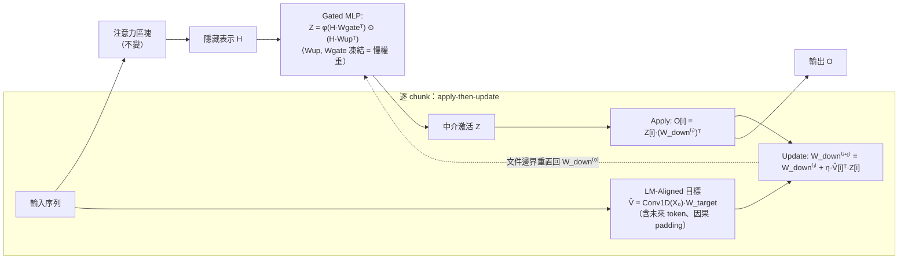

# In-Place Test-Time Training（In-Place TTT）— 完整整理

> **論文**：In-Place Test-Time Training
> **發表**：**ICLR 2026**（conference paper）
> **作者**：Guhao Feng¹²\*, Shengjie Luo¹\*, Kai Hua¹, Ge Zhang¹, Wenhao Huang¹†, Di He²†, Tianle Cai¹（\* 共同一作，† 通訊）
> **單位**：¹ ByteDance Seed、² 北京大學 通用人工智慧國家重點實驗室
> **一句話**：把 LLM 既有 MLP 區塊的「最後投影矩陣 `W_down`」當成可在推論時即時更新的 **fast weights**，配上「與 Next-Token Prediction 對齊」的目標與 **chunk-wise + 上下文平行** 更新，讓任何預訓練 LLM 以 **drop-in** 方式獲得 Test-Time Training（測試時訓練）能力。

> 本文件依 PDF 原文逐節整理：公式（Eq.1、Thm.1）、Algorithm 1、Table 1–3、Figure 2–4 與各 Appendix 結論均取自原文。

---

## 1. 一句話總結（TL;DR）

> 傳統 LLM 是「**訓練完就凍結**」，部署後權重不再變，難以對「不斷流入的長序列上下文」做動態適應。**Test-Time Training (TTT)** 讓一小撮「fast weights」在推論時即時更新以記住上下文，但在 LLM 生態有三大障礙：①要用特製層、得從頭預訓練；②逐 token 更新、序列化、慢；③用通用「重建」目標、和語言模型的 NTP 目標不對齊。
>
> **In-Place TTT** 一次解掉三者：①**就地（in-place）重用 gated MLP 的 `W_down`** 當 fast weights → 不改架構、可從預訓練權重熱啟動（drop-in）；②**chunk-wise 大區塊更新（512~1024）+ 上下文平行（CP）** → 高吞吐；③**LM-Aligned 目標**：用 Conv1D 把「未來 token 資訊」放進更新目標、配合相似度損失，理論上能直接抬高「正確下一個 token」的 logit。
>
> 成效：讓 Qwen3-4B 在 **128k（甚至外推到 256k）** 長上下文更強；從頭訓練時穩定贏過 SWA / GLA / DeltaNet / LaCT；且額外開銷可忽略。

---

## 2. 研究背景與動機

### 2.1 問題：靜態「train then deploy」的根本限制
- LLM 成功建立在「先大量預訓練、部署後凍結」的範式上 → **部署後權重不能更新**，無法對「串流輸入 token 提供的特定上下文」做動態適應。
- 結果：在**長程、演化中的任務**上受限，也無法像人類一樣從**無界經驗流**持續學習。

### 2.2 兩條既有路線與不足
- **In-context learning**：把過去 token 全留在上下文 → 受**上下文視窗**與注意力**二次複雜度**限制。
- **Test-Time Training (TTT)**：引入一小撮 **fast weights**，每來新輸入就即時更新，用自監督目標把上下文壓進這個「線上演化狀態」。比起「只是讓靜態模型更省」，TTT 直接針對「動態更新權重」這個痛點。

### 2.3 TTT 在 LLM 生態的三大障礙（本文要解的）
| 障礙 | 說明 |
|---|---|
| **(i) 架構不相容** | 既有 TTT 多是「取代注意力的特製遞迴層」，需**從頭預訓練**才有好表現 → 對十億級 LLM 成本過高。 |
| **(ii) 計算低效** | 標準 TTT 是**逐 token 序列更新**，嚴重卡住 GPU/TPU 平行度；TTT 當主 token mixer 時被迫用小 chunk。 |
| **(iii) 目標不對齊** | 主流用**通用重建（reconstruction）目標**（把 `v` 設成當前 token 自身），與自回歸 LM 的 **Next-Token Prediction（NTP）** 沒有直接關係，可能次優。 |

---

## 3. 預備知識：Test-Time Training（原文 §2）

- **Fast weights `W`**：一個小網路 `f_W(·): ℝᵈ→ℝᵈ`，測試時被快速更新，當作動態記憶體儲存/檢索上下文。
- 每個 token `xᵢ` 投影出 query `qᵢ`、key `kᵢ`、value `vᵢ`，TTT 兩步驟：
  1. **Update（更新）**：把 `(kᵢ, vᵢ)` 關聯寫進記憶——一步梯度下降 `Wᵢ ← Wᵢ₋₁ − η∇_W L(f_{Wᵢ₋₁}(kᵢ), vᵢ)`。
  2. **Apply（套用）**：用更新後的 `f_{Wᵢ}` 處理 query：`oᵢ = f_{Wᵢ}(qᵢ)`，輸出已含前文資訊。
- **LLM 上的三個 desiderata**（直接對應上面三障礙）：**架構相容（能熱啟動）**、**計算高效（要超越逐 token、用 chunk-wise）**、**為 LM 量身的目標（要對齊 NTP，而非通用重建）**。

---

## 4. 核心概念（術語表）

| 概念 | 說明 |
|---|---|
| **Fast weights（快權重）** | 推論時即時更新、用來記住當前上下文的一小撮參數。本文 = MLP 的 `W_down`。 |
| **Slow weights（慢權重）** | 預訓練學到、推論時凍結的通用知識。本文 = MLP 的 `W_up`、`W_gate`（與其餘權重）。 |
| **In-place 重用** | 不新增/不取代層，直接把既有 MLP 的最後投影矩陣**就地**當 fast weights 更新 → drop-in、保留預訓練完整性。 |
| **Chunk-wise update** | 把序列切成大小 `C` 的非重疊 chunk，逐 chunk 做「先 apply 再 update」，取代逐 token，換取平行度（最佳 `C=512~1024`）。 |
| **LM-Aligned 目標** | 把更新目標 `v̂` 設成「含未來 token 資訊」（`Conv1D(X₀)·W_target`），讓 fast weights 壓的是「對預測下一個 token 有用」的資訊。 |
| **Context Parallelism (CP)** | 沿序列長度切分、各 chunk 同時處理；本文更新規則的**結合律**讓它能用 prefix-sum 平行掃描、又等價於嚴格因果的序列更新。 |

---

## 5. 方法：In-Place TTT（原文 §3）



### 5.1 重用 MLP 區塊當 fast weights（解障礙 i）
- 既有 TTT 想**取代注意力** → 高風險、且新增隨機初始化層與十億預訓練參數衝突，需昂貴重訓。
- **核心洞見**：TTT 對 fast weights 沒有限制，**任何參數都能當 fast weights**。而 Transformer 的 MLP 本就是一種 **key-value 記憶體**（Geva 2020），平常存「慢權重」般的通用知識——自然可順手讓它**同時**當「快權重」存上下文。
- **作法（gated MLP）**：`O = (φ(H·W_gateᵀ) ⊙ (H·W_upᵀ))·W_downᵀ`。
  - `W_up`、`W_gate` → **凍結（慢權重）**；
  - `W_down`（最後投影矩陣）→ **可適應的 fast weights，推論時就地更新**。
- 好處：不改架構、保留預訓練權重、可即時適應、**drop-in**。

### 5.2 Chunk-wise 高效更新（解障礙 ii）
- 因為**只改 MLP、注意力層原封不動**，就**擺脫了逐 token 因果約束**，可用**大 chunk**。
- 流程：給中介激活 `Z = φ(H·W_gateᵀ)⊙(H·W_upᵀ) ∈ ℝⁿˣᵈff` 與目標/輸出 `V, O`，切成 `k` 個大小 `C` 的 chunk。對每個 chunk `i`：
  1. **Apply**：`O[i] = Z[i]·(W_down⁽ⁱ⁾)ᵀ`；
  2. **Update**：`W_down⁽ⁱ⁺¹⁾ = W_down⁽ⁱ⁾ − η∇_W L(Z[i](W_down⁽ⁱ⁾)ᵀ, V[i])`。
- 大 chunk → 充分利用 GPU/TPU 平行度（消融證明 `C=512~1024` 最佳）。

### 5.3 LM-Aligned 目標（解障礙 iii）
- 既有重建目標：`k`、`v` 都是同一個當前 token `x` 的線性投影 → 只是**記住當前 token**，對 LM 次優。
- 本文：讓目標含**未來 token 資訊**：`V̂ = Conv1D(X₀)·W_target`，`X₀` 是 token embedding、`W_target` 可訓練。
  - 「下一個 token」目標 = `W_target` 設為恆等、`Conv1D` 核對「下一個 token 取 1、其餘取 0」。
  - 可一般化成「未來多個 token 的局部加權組合」（呼應 Multi-Token Prediction）。
- 損失用相似度 `L(·,·) = −⟨·,·⟩_F`（負 Frobenius 內積），於是 chunk 更新有**閉式**（**Eq.1**）：
  $$W_{down}^{(i)} = W_{down}^{(i-1)} + \eta\,\hat{V}_{[i]}^\top Z_{[i]}$$
  （無需逐步反向傳播、直接外積累加，極利於平行。）

### 5.4 理論分析：為何 NTP 對齊更好（原文 §3.3，Theorem 1）
- 在 **induction head**（被認為是 in-context learning 關鍵機制）設定下分析：序列某處出現 `(k*, v*)`，之後 `k*` 再現於查詢位置 `n`，模型要預測 `v*`。
- 比較兩種目標：**重建** `V_t = E_{x_t}`（當前 token embedding） vs **LM-Aligned** `V_t = E_{x_{t+1}}`（下一個 token embedding）。
- **Theorem 1**（在「embedding 近正交」「key-query 對齊」兩個溫和假設下）：
  - **正確 logit 上升**：`E[Δℓₙ[v*]] ≥ λ·c²_norm·c_align`（**LM-Aligned**）；
  - **其他 logit 幾乎不動**：`|E[Δℓₙ[w]]| ≤ λ·ε·c_align`；
  - **重建目標**對正確 token 的提升可忽略：`|E[Δℓₙ[v*]]| ≤ λ·ε·c_align`。
- **結論**：NTP 對齊目標**保證在期望上抬高正確下一個 token 的 logit**，直接幫到預測；重建目標沒有這個好處。

### 5.5 實作：上下文平行 + 嚴格因果（原文 §3.4，Algorithm 1）
- Eq.1 的更新具**結合律** → 可上下文平行（CP）。三階段：
  1. 各 chunk **平行**算 `Z[i]` 與更新量 `ΔW⁽ⁱ⁾ = (V̂[i])ᵀZ[i]`；
  2. 對 `[ΔW⁽¹⁾,…,ΔW⁽ᵀ⁾]` 做一次 **prefix sum（CUMSUM）** 得各 chunk 的累積更新 `Sᵢ`；
  3. 各 chunk **平行**算有效快權重 `W_down⁽ⁱ⁻¹⁾ = W_down⁽⁰⁾ + η·Sᵢ` 與輸出 `O[i] = Z[i](W_down⁽ⁱ⁻¹⁾)ᵀ`。
- **因果與邊界**：對 Conv1D 用**因果 padding**，確保 chunk 的更新不含未來資訊 → 平行掃描在數學上**等價於序列更新**；**文件邊界把 fast weights 重置回 `W_down⁽⁰⁾`**，避免跨獨立序列洩漏。
- 結果模組：**CP 原生、完全因果、可 drop-in 取代標準 MLP**。框架與「具體損失/優化器」正交（留作未來探索）。

---

## 6. 如何運作（原文 Algorithm 1：單層、含上下文平行）

```text
Require: 預訓練權重 θ（含 Wup, Wgate, W_down⁽⁰⁾）；Conv1D 核 K；投影 Wtarget；學習率 η
Input : 序列 chunks {X⁽ⁱ⁾}, i=1..T   # 沿序列切分供 CP

# Step 1：各 chunk 平行算「更新量」
for all i in 1..T  (parallel):
    Hᵢ   ← AttentionBlock(X⁽ⁱ⁾; θ)          # 注意力照舊、不動
    Uᵢ,Gᵢ← Hᵢ Wupᵀ , Hᵢ Wgateᵀ
    Zᵢ   ← φ(Gᵢ) ⊙ Uᵢ                        # gated MLP 的中介激活
    Vᵢ   ← Conv1D_K(X₀⁽ⁱ⁾) Wtarget           # NTP 對齊目標（因果 padding）
    ΔWᵢ  ← Vᵢᵀ Zᵢ                            # fast weight 更新梯度（外積）

# Step 2：結合律 → 前綴和聚合
{Sᵢ} ← CUMSUM({ΔWᵢ})

# Step 3：各 chunk 平行套用更新並算輸出
for all i in 1..T  (parallel):
    W_down⁽ⁱ⁻¹⁾ ← W_down⁽⁰⁾ + η Sᵢ          # 第 i 個 chunk 只用「<i」的更新
    Oᵢ          ← Zᵢ (W_down⁽ⁱ⁻¹⁾)ᵀ

# 文件邊界：把 fast weights 重置回 W_down⁽⁰⁾
```

> 直覺：**「先用目前快權重算輸出（apply），再用本 chunk 的 (Z, V̂) 更新快權重（update）」** 的 apply-then-update 迴圈，讓模型嚴格因果地把流入上下文壓進 `W_down`。

---

## 7. 實驗設定（原文 §4 與 Appendix D）

### 7.1 三組實驗回答三問題
- **Q1**：In-Place TTT 能否以 drop-in 方式增強既有預訓練 LLM？
- **Q2**：從頭訓練時，與既有 TTT 類方法比如何？
- **Q3**：各設計選擇的影響（消融）？

### 7.2 模型與資料
- **Drop-in（Q1）**：Qwen3-4B-Base（原 32k 視窗）；延伸到 **LLaMA-3.1-8B、Qwen3-14B-Base**。
  - **持續訓練課程**：第一階段 ~**20B tokens @ 32k**，第二階段 ~**15B tokens @ 128k**；用 **YaRN** 擴展 RoPE。
- **從頭訓練（Q2）**：500M / 1.5B（對比 TTT 與高效注意力）、4B（規模化，**120B tokens @ 8k**）。
- **資料**：自建語料（中英文 + 高知識/推理密度 + 程式 + 數學 + 多語）；持續訓練另含長文件（書籍、repo 級程式、合成 RAG / 長上下文 QA）。

### 7.3 評測基準
- **長上下文**：**RULER**（4k~256k；256k 用來測**外推**），跑於 OpenCompass。
- **從頭訓練**：500M/1.5B 用 **Sliding Window Perplexity**（Pile + Proof-Pile-2）；4B 另加常識推理（HellaSwag、ARC、MMLU、PIQA）與 RULER。
- **效率**：prefill 吞吐量、峰值記憶體。

### 7.4 baselines
- 從頭訓練對比：**SWA**（滑動視窗注意力）、**GLA**（Gated Linear Attention）、**DeltaNet**、**LaCT**（Large Chunk TTT）。（In-Place TTT 與 LaCT 皆建在 **SWA backbone** 上以公平比較。）

---

## 8. 主要結果

### 8.1 Q1：drop-in 增強（RULER，Qwen3-4B-Base，原文 Table 1）
| 模型 | 4k | 8k | 16k | 32k | 64k | 128k | 256k(外推) |
|---|---|---|---|---|---|---|---|
| Baseline | 96.6 | 94.1 | 92.1 | 88.7 | 74.3 | 74.8 | 41.7 |
| **In-Place TTT** | 96.1 | **95.6** | **92.7** | **89.3** | **78.7** | **77.0** | **43.9** |
- **越長越強**：短上下文相當，**長上下文（64k/128k）優勢明顯拉大**，且**外推到 256k 仍維持**。
- **Table 2 延伸**：LLaMA-3.1-8B **64k +2.1**；Qwen3-14B-Base **64k +2.7**；與 **YaRN 正交**（可疊加）。跨 4B~14B、不同家族皆有效。

### 8.2 Q2：從頭訓練對比（原文 Figure 2、Table 3）
- **Figure 2（500M & 1.5B，Sliding Window Perplexity）**：In-Place TTT 在 2k~32k **全程 perplexity 最低**，贏過 SWA / GLA / DeltaNet / LaCT，且隨上下文增長持續改善。
- **Table 3（4B 從頭訓練）**：常識推理多數任務提升；長上下文大幅提升——
  - **Full Attention**：RULER-16k **6.58 → 19.99**；
  - **SWA**：RULER-8k **9.91 → 26.80**。

### 8.3 效率（原文 Figure 4）
- 4B 模型（SWA / Full Attention，8k~128k）下，加上 In-Place TTT 的 **prefill 吞吐與峰值記憶體額外開銷可忽略**。

---

## 9. 消融研究與洞見（原文 §4.3，Figure 3，1.7B on RULER）

### 9.1 狀態大小（State size，圖 3a）
- 透過「**啟用 TTT 的層數**」控制 fast weights 大小。**狀態越大、表現越好**（4× > 1× > 0.5×）。
- **洞見**：更大的快權重能更有效吸收上下文 → 佐證「重用 MLP 的大量狀態」這個方向的價值。

### 9.2 Chunk 大小（圖 3b）
- 測 `C = 256 / 512 / 1024 / 2048`：**`C=512` 與 `C=1024` 最佳**（中間值），`C=1024` 效率更好。
- **洞見**：In-Place TTT 天生適合**大 chunk** 更新（既非太小也非太大），兼顧效能與平行度。

### 9.3 LM-Aligned 目標的兩個元件（圖 3c）
- 拆解 `V̂ = Conv1D(X₀)·W_target`：測 {有 Conv+Proj / 去 Conv / 去 Proj / 兩者都去}。
- **兩者都必要**；**Conv1D 對長上下文關鍵**（提供未來 token 資訊），**W_target 對短上下文關鍵**。
- **洞見**：與 Theorem 1 一致——量身的 NTP 對齊目標確實重要，通用重建不夠。

---

## 10. 與相關工作的關係
| 主題 | 關係 |
|---|---|
| **取代注意力的 TTT/遞迴層**（Titans、DeltaNet、GLA、Mamba/SSM 等） | In-Place TTT **不取代注意力**，而是**補充**它（只動 MLP），故能 drop-in、免從頭訓練。 |
| **LaCT（Large Chunk TTT）** | 最接近的對手；同樣大 chunk，但 In-Place TTT 用 in-place MLP + NTP 對齊目標，效能更好（Figure 2）。 |
| **Fast weights / linear transformer**（Schlag、Ba、Irie & Gershman） | 理論根基；本文把 MLP 的 `W_down` 詮釋為 fast weights。 |
| **MLP = key-value memory**（Geva 2020） | 動機來源：MLP 本就是記憶體，自然兼任快權重。 |
| **Multi-Token Prediction**（DeepSeek 等） | LM-Aligned 目標的一般化版本（未來多 token 的局部組合）與之呼應。 |
| **YaRN / RoPE 擴展** | 正交、可疊加。 |

---

## 11. 貢獻 / 優點 / 限制

**主要貢獻**
1. **In-Place TTT 框架**：就地重用 MLP `W_down` 當 fast weights → **drop-in、免從頭訓練**，解架構不相容。
2. **chunk-wise + CP 原生**更新：大 chunk、平行掃描、嚴格因果，解計算低效。
3. **LM-Aligned 目標 + 理論保證（Theorem 1）**：用 Conv1D 注入未來 token 資訊，證明能抬高正確 token logit，解目標不對齊。

**優點**
- 🔌 drop-in、保留預訓練權重；⚡ 大 chunk 高吞吐、額外開銷可忽略；📈 長上下文（128k、外推 256k）顯著提升；🧩 跨 4B~14B、多家族通用；🔁 與 YaRN/RoPE 擴展正交。

**限制 / 未竟**
- 主要用**語言建模/長上下文**當「長程演化任務」的代理；更廣的 agent/持續學習任務待驗證。
- 框架與**損失函數/優化器選擇正交**——更佳的 TTT 損失/優化器（豐富的 TTT 文獻）尚未在此框架系統探索。
- 仍需一段（相對便宜的）**持續訓練**來啟用 TTT 行為（非零成本即插即用）。

---

## 12. 重點速記（Cheat Sheet）
- **問題**：LLM 部署後凍結 → 難對長串流上下文動態適應；TTT 有「架構不相容 / 低效 / 目標不對齊」三障礙。
- **方法**：把 gated MLP 的 **`W_down` 當 fast weights 就地更新**（`W_up`、`W_gate` 凍結）。
- **更新**：chunk-wise「**apply-then-update**」，閉式 `W_down += η·V̂ᵀZ`（Eq.1），CP + prefix-sum 平行、因果 padding、文件邊界重置。
- **目標**：**LM-Aligned**（`V̂ = Conv1D(X₀)W_target`，含未來 token）；Theorem 1 保證抬高正確 logit。
- **最佳設定**：chunk `C=512~1024`；狀態越大越好；Conv1D 顧長文、W_target 顧短文。
- **成績**：Qwen3-4B RULER 64k 74.3→78.7、128k 74.8→77.0、256k 外推 41.7→43.9；4B 從頭 Full-Attn RULER-16k 6.58→19.99；贏 SWA/GLA/DeltaNet/LaCT；開銷可忽略。

---

## 13. 參考連結
- 主題相關：TTT（Sun et al. 2020/2024）、Titans（[2501.00663](https://arxiv.org/abs/2501.00663)）、LaCT（Zhang et al. 2025）、DeltaNet、GLA（[2312.06635](https://arxiv.org/abs/2312.06635)）
- 評測：RULER（[2404.06654](https://arxiv.org/abs/2404.06654)）、YaRN（[2309.00071](https://arxiv.org/abs/2309.00071)）
- 概念：Fast weights（Ba et al. 2016, [1610.06258](https://arxiv.org/abs/1610.06258)）、MLP=KV memory（Geva et al. 2020, [2012.14913](https://arxiv.org/abs/2012.14913)）、Induction heads（Olsson et al. 2022）

---

*整理依據：使用者提供之「In-Place Test-Time Training」PDF 原文（ICLR 2026），逐節擷取 §2–§4、Theorem 1、Algorithm 1、Table 1–3、Figure 2–4 與 Appendix B–D。*
