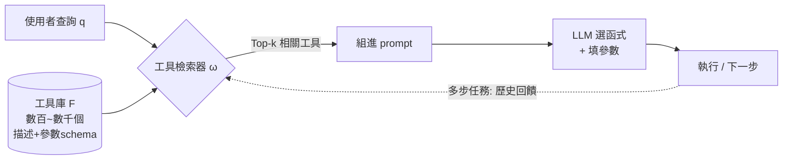
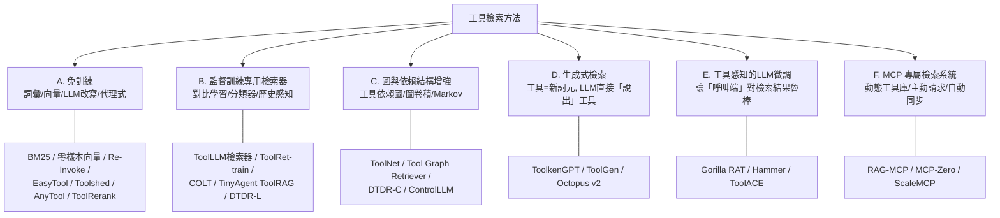

# LLM / MCP 工具檢索(Tool Retrieval)方法與 Benchmark 綜述

> **範圍**:2023–2025 年「LLM 工具檢索 / 函式呼叫前的工具選擇」與「Model Context Protocol(MCP)工具檢索」的方法論文與 benchmark 論文。
> **出處優先級**(依使用者要求):ICLR/ICML/NeurIPS → ACL/EMNLP/NAACL/CIKM/AAAI 等 → workshop → arXiv。同一論文若有會議版,一律標會議版。
> **數字原則**:文中所有數字皆為**原論文回報**(經逐篇網路查證;DTDR 一篇為本地 PDF 原文)。無法逐字查證的表格細格,以原文的定性結論表述,不虛構數值。
> 配套簡報:`LLM工具檢索_入門簡報.pptx`(給只懂一點 AI 基礎的讀者)。

---

## 1. 問題是什麼:為什麼需要「工具檢索」

LLM 代理(agent)靠**函式呼叫(function calling)**操作外部工具/API;MCP(Model Context Protocol)則把工具的描述、參數 schema、呼叫方式標準化,讓工具生態爆炸性成長(單一代理可接上千工具)。這帶來兩個直接問題:

1. **塞不下**:把所有工具描述放進 prompt,上下文超長 → 貴、慢、超出視窗。
2. **選不準**:候選一多,LLM 會被無關工具誤導。RAG-MCP 的壓力測試顯示,當 MCP 工具數量增大時,直接全塞的基線**選對工具的準確率只剩 13.62%**(arXiv [30])。

**工具檢索器(tool retriever)** 因此成為代理管線的標配前置模組:

**形式化**(沿用 DTDR [13] 的記法):給定查詢 `q`、(多步時)已呼叫歷史 `f₀:ₜ₋₁`、全工具集 `F`,檢索器 `ω(·)` 輸出子集 `Fₜ⊆F` 進 prompt;理想是 `{}⊂Fₜ⊆F*ₜ`(`F*ₜ` 為該步的正確工具集合)。**評估指標**:檢索端用 Recall@K / NDCG@K(排序品質)/ COMP@K(完整涵蓋所需工具集,COLT 提出 [7]);下游端用函式選擇正確率、端到端成功率(如計畫 DAG 同構)、pass^k(多次重試的穩定性,τ-bench [28])。

---

## 2. 方法分類總覽(按「怎麼訓練 / 怎麼變強」分五大類 + MCP 專區)

| 大類 | 需要訓練? | 訓練/增強的對象 | 核心訊號 | 代表(venue) |
|---|---|---|---|---|
| A 免訓練 | 否(或只用現成模型) | 查詢/工具描述的表示 | 詞彙/語意相似、LLM 改寫 | Re-Invoke(EMNLP'24F)、AnyTool(ICML'24)、EasyTool(NAACL'25) |
| B 訓練檢索器 | 是(小模型) | 獨立的雙塔/分類器 | 標註的(查詢,工具)對、呼叫歷史 | ToolLLM(ICLR'24)、COLT(CIKM'24)、ToolRet(ACL'25F)、DTDR(arXiv) |
| C 圖/依賴 | 半(建圖或訓 GNN) | 工具間結構 | 示範軌跡中的共現/依賴 | ToolNet(arXiv)、TGR(arXiv) |
| D 生成式 | 是(動 LLM 詞表) | LLM 本體(工具=詞元) | 下一詞元預測 | ToolkenGPT(NeurIPS'23)、ToolGen(ICLR'25)、Octopus v2(arXiv) |
| E 呼叫端微調 | 是(微調 LLM) | 函式呼叫 LLM | 檢索感知訓練、遮罩、合成資料 | Gorilla(NeurIPS'24)、Hammer(ICLR'25)、ToolACE(ICLR'25) |
| F MCP 專屬 | 多為免訓練 | 檢索系統架構 | 向量索引、主動請求、CRUD 同步 | RAG-MCP、MCP-Zero、ScaleMCP(皆 arXiv 2025) |

---

## 3. A 類:免訓練檢索(Training-free)

**共同思路**:不訓練任何參數,靠「查詢 ↔ 工具描述」的相似度;強化手段是**用 LLM 改寫兩端文字**或**用 LLM 當代理逐層找**。優點:零標註、即插即用、工具庫變動不用重訓;弱點:抓不到「任務要成功需要哪組工具」的深層訊號。

### A1. 詞彙 / 零樣本向量相似(基線)
- **怎麼做**:BM25 做詞面比對;或用現成句向量(Sentence-BERT、text-embedding-ada-002 等)對查詢與工具描述編碼、取 cosine 相似度 Top-k。
- **有多強**:幾乎所有論文的墊底基線。ToolRet(ACL 2025 Findings [20])系統性評測顯示:**在傳統 IR benchmark 很強的檢索模型,到了工具檢索一樣表現差**,且這種低品質檢索會直接拉低下游工具使用 LLM 的 pass rate——「會找文件 ≠ 會找工具」。

### A2. Re-Invoke —— 讓 LLM 幫兩端「改寫」(Findings of EMNLP 2024 [8])
- **怎麼變強**(全程無監督、無訓練):
  1. **工具端(離線)**:query generator 為每個工具文件**合成多樣的假設查詢**,把工具文件「擴充」成更貼近使用者口吻的表示;
  2. **查詢端(線上)**:intent extractor 從使用者話語中**抽出核心工具意圖**(去掉聊天雜訊、拆多意圖),再做向量檢索。
- **有多強**:ToolE 單工具檢索 **nDCG@5 相對提升 +20%**、多工具 **+39%**,全面優於 SOTA 零樣本替代方案。

### A3. EasyTool —— 把又長又亂的工具文件改寫成統一精簡說明(NAACL 2025 [15])
- **怎麼變強**:用 LLM 把異質、冗長的工具文件淨化成**統一格式的精簡工具指令**(功能一句話 + 參數示範),供檢索與 prompt 使用。
- **有多強**:ToolBench 上工具文件 **平均 2,530 tokens → 748 tokens(−70.4%)**,並在多個任務上同時提升工具使用表現。

### A4. Toolshed —— 「進階 RAG 全家桶」搬到工具檢索(ICAART 2025 / arXiv [16])
- **怎麼變強**:建「工具知識庫」(向量庫),在**檢索前**(文件增強:加關鍵資訊、合成問題)、**檢索中**(查詢規劃/改寫/分解)、**檢索後**(重排、自我反思)三階段做 RAG 技巧的組合拳;不微調模型。
- **有多強**:Recall@5 **絕對提升**:ToolE 單工具 **+46%**、ToolE 多工具 **+56%**、Seal-Tools **+47%**;可擴展到數百~數千工具。

### A5. AnyTool —— GPT-4 當「階層式檢索代理」(ICML 2024 [6])
- **怎麼變強**(不訓練外部模組):模仿 RapidAPI 的「分類→工具→API」層級,建**階層式 API 檢索代理**(meta-agent→分類 agent→工具 agent),配 **self-reflection**:第一次解不掉就帶著失敗原因重新檢索。
- **有多強**:在 ToolBench(16k+ API)上平均 pass rate **比 ToolLLM +35.4%**、比「給參考 API 的 GPT-4」**+19.3%**;各子集 45.9%–67.6%;自建 AnyToolBench 上 **73.8%**。
- **代價**:靠 GPT-4 多輪呼叫,延遲與成本高——與「輕量檢索器」路線(TinyAgent/DTDR)形成光譜兩端。

### A6. ToolRerank —— 檢索後的自適應重排(LREC-COLING 2024 [9])
- **怎麼變強**:對第一階段檢索結果做 **Adaptive Truncation**(見過/沒見過的工具用不同截斷深度)+ **Hierarchy-Aware Reranking**(單工具查詢讓結果更集中、多工具查詢讓結果更多樣)。
- **有多強**:在 ToolBench 上穩定提升檢索品質,並帶動 LLM 端執行結果改善(原文以消融呈現,無單一頭條數字)。

---

## 4. B 類:監督訓練的專用檢索器(訓練一個小模型來「懂工具」)

**共同思路**:拿標註/合成的(查詢 → 正確工具)資料,**訓練一個獨立小模型**(雙塔向量檢索器或分類器)。優點:便宜、快、可端側;現在的演進方向是把訊號從「語意相似」升級成「**任務完成所需**」。

### B1. ToolLLM 的 API Retriever —— 對比學習雙塔的開山標配(ICLR 2024 Spotlight [1])
- **怎麼訓練**:在 ToolBench(16,464 個 RapidAPI 真實 API)上,用 ChatGPT 生成的 (指令, 相關 API) 對,**微調 Sentence-BERT**(對比學習:查詢向量拉近正確 API、推遠其他)。
- **有多強**:NDCG@1/@5 **全面大幅超越 BM25 與 OpenAI text-embedding-ada-002**;單工具情境(I1)的 NDCG 高於多工具(I2/I3),顯示**多工具檢索更難**。配上 DFSDT 解碼的 ToolLLaMA + 該檢索器,整體達到接近 ChatGPT 的 pass/win rate。
- **地位**:後續論文的最強公版基線(常被稱 ToolRetriever / ToolBench-IR)。

### B2. ToolRet-train —— 用 20 萬筆工具檢索任務「補課」(Findings of ACL 2025 [20])
- **怎麼訓練**:ToolRet 匯集 7.6k 檢索任務、43k 工具的異質 benchmark 之外,另從 ToolACE、APIGen、ToolBench 蒐集 **200k+ 訓練實例**,對現成 IR 模型做工具領域微調。
- **有多強**:主流 IR 模型(含 IR benchmark 上的強者)在 ToolRet 上普遍疲軟;**用 ToolRet-train 微調後檢索能力顯著提升**,並改善下游 pass rate——證明「工具檢索」是需要專門訓練的能力。

### B3. COLT —— 從「找相似」升級成「湊齊一套」(CIKM 2024 [7])
- **怎麼訓練**:兩階段。①語意學習:PLM 雙塔先學查詢-工具語意對齊;②**協同學習**:建「查詢-場景-工具」三分圖,訊息傳遞 + **跨視角圖對比學習**,學到「這個任務**這一組工具要一起出現**」的協同關係;並提出 **COMP@K**(Top-K 是否**完整涵蓋**該查詢的全部所需工具)取代只看單點命中的 Recall/NDCG。
- **有多強**:在 ToolLens 與 ToolBench 上全面優於語意檢索基線(原文 Table 3;亮點是模型小但在 COMP@K 上大勝)。**洞見**:多工具任務「漏一個=整題失敗」,完整性才是對的目標。

### B4. TinyAgent ToolRAG —— 端側多標籤分類器(EMNLP 2024 System Demonstrations [10])
- **怎麼訓練**:場景是 16 個 Mac 助理工具的端側代理。**微調 DeBERTa-v3-small 做多標籤分類**:輸入查詢,輸出每個工具「這題用不用得到」,一次選出工具子集(比 Top-k 向量檢索更貼「組合」性質)。
- **有多強**:ToolRAG 以極小延遲**大幅提升準確率**;配合量化後的 **TinyAgent-1.1B/7B 在整體任務成功率上超過 GPT-4-Turbo**,全程可在筆電離線跑。
- **限制**(DTDR [13] 指出):只看查詢、不看已呼叫歷史,容易過擬合到高頻工具,長計畫時排序品質急遽下降(見 B5)。

### B5. DTDR —— 把「呼叫歷史」也餵給檢索器(arXiv 2512.17052,Qualcomm [13])
- **怎麼訓練**:兩個輕量變體,皆同時條件化於**查詢 q + 已呼叫工具序列 f₀:ₜ₋₁**:
  - **DTDR-L(監督)**:凍結句向量模型上訓 **1 層線性分類器**,輸入 `embed(q + 歷史)`,對每步的「DAG 可接受工具集」做 BCE 多標籤訓練,推論取機率 > α 的工具;
  - **DTDR-C(無監督)**:示範查詢 K-means 分群(K≈訓練集 1/10),每群建 **N 階 Markov 工具依賴圖**(最佳 N=3),測試時「查詢找群、歷史走圖」。
- **有多強**(原文,Qwen3-0.6B、TinyAgent 資料集):函式選擇正確率 **65.1 vs 靜態 Learned Retriever 25.6**,MRR **0.93 vs 0.53**;端到端成功率**比最強靜態檢索基線 +15%~200%、比 No-ICL +300%~600%**(整體宣稱:比 SOTA 靜態檢索器提升 **23%–104%**);同時把總 prompt 長度**砍最多 73%**。長計畫(長度 9)Top-1 檢索準確率 DTDR-L 仍有 **85.1%**,靜態 LR 掉到 12.9%。
- **洞見**:多步任務裡,「你已經呼叫了什麼」是比查詢本身更強的下一步訊號;歷史感知是靜態檢索器的主要升級方向。

---

## 5. C 類:圖與依賴結構增強(把「工具之間的關係」放進檢索)

**共同思路**:工具不是孤島——A 的輸出常是 B 的參數(依賴)。從示範軌跡挖出這種結構,建**工具依賴圖**,用它縮小候選或強化表示。

### C1. ToolNet —— 在工具圖上「走格子」(arXiv 2403.00839 [11])
- **怎麼建**:從歷次軌跡把工具組成**有向加權圖**(邊=轉移機率)。LLM 每步只看「目前工具節點的後繼」,一步步在圖上導航,直到解題。
- **有多強**:把可用工具規模拉到**數千級**而 token 消耗僅適度增加;在多跳工具任務上表現出色、對故障工具有韌性(原文以多個資料集消融呈現)。
- **限制**(DTDR 指出):只條件化「最近一次呼叫」,一階轉移會被高頻共現誤導(例如自我迴圈),且不看查詢。

### C2. Tool Graph Retriever(TGR)—— 用圖卷積把依賴「揉進」向量(arXiv 2508.05152 [12])
- **怎麼訓練**:①造 **TDI300K** 資料集,訓一個**工具依賴判別器**;②離線判出候選工具間的依賴邊,建圖;③檢索時用**圖卷積**把依賴資訊融進工具 embedding,再做向量檢索。
- **有多強**:在三個指標上**顯著提升各種現成文字向量模型**、大幅超越詞頻法;套在已微調的 ToolBench-IR 上**再創 SOTA**;圖越密、增益越大。

### C3. 其他
- **ControlLLM**(ECCV 2024):已知工具依賴圖時,用**圖上搜尋(Thoughts-on-Graph)** 找可行工具鏈——屬「已知圖」情境的規劃式檢索。
- **Graph RAG-Tool Fusion**(arXiv 2502.07223):Toolshed 團隊的後續,把「向量檢索」與「工具知識圖上的依賴遍歷」融合。
- **DTDR-C**(見 B5):也可視為本類——「查詢分群 + 群內 N 階 Markov 圖」。

---

## 6. D 類:生成式檢索——工具變成「新詞元」,LLM 自己「說出」要用哪個

**共同思路**:不再外掛檢索器,而是**擴充 LLM 詞表**,每個工具一個(或一組)專屬 token;「檢索」變成「生成下一個詞元」,天然拿到 LLM 全部上下文理解力,也免掉「先檢索再塞 prompt」的長上下文。

### D1. ToolkenGPT —— 凍結 LLM,只學「工具詞元嵌入」(NeurIPS 2023 Oral [3])
- **怎麼訓練**:每個工具一個 **toolken embedding** 接到 LM head;**LLM 本體完全凍結,只訓練這些嵌入**(像加新詞)。生成中一旦預測到 toolken 就切換到工具模式填參數,完成後返回。
- **有多強**:在數值推理(GSM8K-XL、FuncQA)、知識問答(KAMEL)、具身規劃(VirtualHome)上,**大量工具即插即用**,勝過 few-shot ICL 與 ReAct 式基線(原文 Table;其賣點是「可隨時擴充大量工具、成本≈學嵌入」)。

### D2. ToolGen —— 47k 真實工具全部塞進詞表(ICLR 2025 [5])
- **怎麼訓練**:ToolBench 的 **47k 工具各配一個唯一虛擬 token**,三階段:
  1. **工具記憶**:以工具文件為輸入、預測其 token(把工具知識「灌進」參數);
  2. **檢索訓練**:查詢 → 生成相關工具 token(LLM 本體=生成式檢索器);
  3. **代理微調**:端到端軌跡訓練,規劃+呼叫一體。
- **有多強**(原文 Table 1):檢索上 **NDCG 全面超越對比學習的 ToolRetriever**,在 I1 的 NDCG@5 與 I2 的 NDCG@1/3/5 甚至**超過帶 GPT-3.5 迭代回饋的 IterFeedback 管線**;在更難的**多域全量(47k 工具)設定仍穩健**;端到端優於 ToolLlama 系。
- **洞見**:把「檢索」內化成「生成」,單一模型同時當檢索器+呼叫器,是對「外掛雙塔」路線的正面挑戰。

### D3. Octopus v2 —— 端側「functional token」(arXiv 2404.01744 [19])
- **怎麼訓練**:2B 小模型,把**每個函式名對應成 functional token**,微調學會「描述→token」映射;推論直接生成該 token + 參數。
- **有多強**:函式呼叫準確率 **99.524%**、延遲 **0.38 秒/次**;比「Llama-7B + RAG 式函式檢索呼叫」**延遲改善約 35×**,上下文長度 **−95%**;準確率超過 GPT-4 同場景基線。
- **定位**:工具集固定的行動裝置場景(Android API 等),是 D 類思路的極端工程化。

---

## 7. E 類:工具感知的 LLM 微調(把「呼叫端」練壯)

**共同思路**:檢索器再好,呼叫端 LLM 也要「會用檢索結果」:對不完美檢索魯棒、看得懂文件、知道**該不呼叫就不呼叫**。

### E1. Gorilla —— Retriever-Aware Training(NeurIPS 2024 [4])
- **怎麼訓練**:自建 APIBench(TorchHub/TensorHub/HuggingFace 模型 API)。微調 LLaMA-7B 時**把「檢索到的 API 文件」直接放進訓練輸入**,教模型「參考文件寫呼叫」而非硬背;評測用 **AST 子樹匹配**判斷 API 呼叫正確與幻覺。
- **有多強**:在 Torch Hub 與 HuggingFace 上**超過 GPT-4**;能適應**測試時 API 文件變動**(版本/參數更新),**大幅減少幻覺**。
- **洞見**:「檢索感知」訓練讓模型與檢索器**共生**——文件變了不用重訓模型。

### E2. Hammer —— function masking + 無關性偵測資料(ICLR 2025 Spotlight [17])
- **怎麼訓練**:①**函式遮罩**:訓練時把函式/參數**名稱換成隨機字串**,強迫模型只依賴**描述**判斷(防「靠名字猜」造成的跨庫崩壞);②增造 **7,500 筆無關性增強資料**,教模型辨識「候選裡沒有合適工具」。
- **有多強**:**Hammer-7B 在 BFCL v2 與 GPT-4/GPT-4o 級閉源模型同場競技**,並在多個 benchmark 上展現 SOTA 級的穩健泛化;開源全部資料與模型。
- **與檢索的關係**:檢索器給的候選常有雜訊——Hammer 練的正是「在被檢索進來的候選中選對/拒答」。

### E3. ToolACE —— 用合成資料把 8B 練到 GPT-4 級(ICLR 2025 [18])
- **怎麼訓練**:自演化合成 **26,507 個 API 池**;多代理互演對話,複雜度評估器把關;規則+模型**雙層驗證**確保資料正確性;拿去微調 8B 模型。
- **有多強**:**8B 模型在 BFCL-v3 上達到與最新 GPT-4 系相當的 SOTA 級表現**。
- **定位**:資料中心路線——「工具選擇/呼叫能力」可以用高品質合成資料直接蒸進小模型。

---

## 8. F 類:MCP 專屬檢索系統(2025 起的新戰場)

**MCP 的新難點**:工具掛在**多個 server** 上、動態上下架、schema 異質、官方生態已達數千工具——「把所有 MCP 工具 schema 全塞 prompt」徹底不可行。

### F1. RAG-MCP —— 最直接的「先檢索再給」(arXiv 2505.03275 [30])
- **怎麼做**(免訓練):把所有 MCP 工具 schema 建**外部向量索引**;查詢先語意檢索出最相關的少數 MCP,**只把它們的描述**給 LLM。
- **有多強**:MCP 壓力測試中,選對工具準確率 **43.13% vs 全塞基線 13.62%(>3×)**;prompt tokens **1,084 vs 2,133.8(−50%+)**。
- **限制**:原文自承——工具庫到**數千級**時,檢索精度與吞吐開始退化(單層向量索引的天花板)。

### F2. MCP-Zero —— 反轉主客:LLM「主動開口要工具」(arXiv 2506.01056 [31])
- **怎麼做**(免訓練):①**Active Tool Request**:模型自己生成結構化請求「我需要一個能做 X 的工具」;②**階層語意路由**:先匹配 MCP **server**、再到 server 內找**工具**(兩階段);③**迭代能力擴充**:邊做邊要,逐步組跨域工具鏈。並發布 **MCP-tools 資料集(308 個 server、2,797 個工具)**。
- **有多強**:在近 **3k 候選工具(描述總量 248.1k tokens)** 中準確選中;APIBank 上 **token 消耗 −98%** 且維持高準確率;多輪任務中隨工具生態成長仍穩定。
- **洞見**:與其「猜模型要什麼」,不如讓模型**自己說**——檢索從被動匹配變成按需服務。

### F3. ScaleMCP —— 把「檢索工具」本身做成一個 MCP 工具(arXiv 2505.06416 [32])
- **怎麼做**:①給代理一個 **MCP Retrieval Tool**,由代理**自主呼叫**、把找到的工具**加進自己的記憶**(agentic memory);②**自動同步索引**:以 MCP server 為唯一真相源,hash 比對做 CRUD,工具上下架自動反映到索引;③提出 **TDWA**(Tool Document Weighted Average)嵌入:對工具名/描述/合成問題等成分加權。
- **有多強**:自建 **5,000 個金融指標 MCP server** 的資料集,橫掃 10 個 LLM × 5 種嵌入模型 × 5 種檢索器的組合,檢索與代理呼叫表現**全面顯著提升**(原文以矩陣實驗呈現)。
- **洞見**:MCP 時代的檢索是**活系統**——重點從「一次檢索」變成「索引與工具庫的持續同步 + 代理自主取用」。

---

## 9. Benchmark 總覽

### 9.1 通用工具檢索 / 工具使用

| Benchmark | Venue | 規模 | 測什麼 | 關鍵原文數字/發現 |
|---|---|---|---|---|
| **ToolBench / ToolEval** [1] | ICLR 2024 (Spotlight) | 16,464 真實 RapidAPI | 檢索(NDCG)+ 端到端 pass/win rate | 多工具檢索明顯難於單工具;訓練檢索器全面勝 BM25/Ada |
| **API-Bank** [22] | EMNLP 2023 | 73 API、314 對話、753 呼叫 | 三層能力:call / retrieve+call / plan+retrieve+call | GPT-4 在規劃層最強;檢索是第 2、3 層的內建環節 |
| **ToolQA** [23] | NeurIPS 2023 (D&B) | 8 域外部資料 QA | 只看**最終答案**對不對(工具過程不設限) | 把「工具用得好不好」化約為端到端可驗證答案 |
| **MetaTool** [24] | ICLR 2024 | ToolE:21,127 查詢;199 工具、4,287 測例 | ①該不該用工具(awareness)②選哪個(4 子任務:相似/情境/可靠性/多工具) | 零樣本 awareness 只有 ChatGPT F1>70%,其餘低至 11.53%——**「要不要用」比「用哪個」更早失守** |
| **TaskBench** [25] | NeurIPS 2024 (D&B) | 3 域工具圖 | 任務分解 + **工具呼叫圖**(node-F1 / edge-F1)+ 參數 | **連邊比選點難 ~30% F1**——依賴預測是主要瓶頸 |
| **StableToolBench** [26] | Findings of ACL 2024 | ToolBench 的穩定化 | 虛擬 API server(快取+模擬)+ solvable pass/win | 解決真實 API 隨時掛掉造成的評測漂移 |
| **ToolRet** [20] | Findings of ACL 2025 | 7.6k 檢索任務、43k 工具 + 200k 訓練集 | 第一個**專測工具檢索**的異質 IR benchmark | 強 IR 模型也表現差;檢索差→下游 pass rate 掉;ToolRet-train 微調有效 |
| **BFCL** [21] | ICML 2025 | 17 類任務,持續更新 V1→V4 | AST 驗證函式呼叫;**relevance/irrelevance 偵測**;多語言/平行呼叫/代理式 | 業界事實標準排行榜;「不該呼叫時不呼叫」被列為一級能力 |
| **τ-bench / τ²-bench** [28,29] | arXiv 2024 / 2025 | retail、airline 等域 | 模擬使用者多輪對話 + 工具 + 政策;**pass^k** 穩定性 | GPT-4o 級代理成功率 **<50%**,retail pass^8 **<25%**——一次對≠次次對 |
| **Seal-Tools** [27] | NLPCC 2024 | 大規模 self-instruct 工具資料 | 含嵌套呼叫的工具選擇/填參 | Toolshed 等檢索論文的常用評測集 |

### 9.2 MCP 專屬 benchmark

| Benchmark | Venue | 規模 | 測什麼 | 關鍵原文數字 |
|---|---|---|---|---|
| **MCP-Universe** [33] | arXiv 2025(Salesforce) | 11 個真實 MCP server、6 域、231 任務 | 端到端真實任務(地圖/repo/金融/3D/瀏覽器/搜尋),執行結果評分 | **GPT-5 43.72%、Grok-4 33.33%、Claude-4-Sonnet 29.44%**——最強模型也 fail 過半;長上下文與**陌生工具**是兩大死因 |
| **MCP-Bench** [34] | arXiv 2025(Accenture) | 28 個 live MCP server、250 工具 | **模糊指令(不給工具名)**下的檢索+多跳規劃+跨域編排;規則+LLM judge | 直接把「工具檢索」列為受測能力 |
| **LiveMCPBench** [35] | arXiv 2025 | 70 server、527 工具、95 任務 | 大規模工具海中的日常任務;LLM-as-judge(與人類 81% 一致) | 最佳 **Claude-Sonnet-4 78.95%**,模型間差異巨大 |
| **MCPToolBench++** [36] | arXiv 2025(Ant Group) | 4,000+ MCP server 池;1,500+ 查詢、40+ 類別 | 單步與多跳 MCP 工具呼叫;AST 與執行雙評 | 即使結構對,**參數不合/API 特異性**仍普遍讓執行失敗 |
| MCP-tools(資料集)[31] | arXiv 2025 | 308 server、2,797 工具 | MCP 工具**檢索語料**(配 MCP-Zero) | — |

> 另有 MCPEval、MCP-RADAR、LiveMCP-101 等 2025 年 arXiv 評測框架,方向類似(執行導向、多維度),尚未見會議版。

---

## 10. 橫向洞見(讀完 30 篇後的 7 條總結)

1. **「會找文件 ≠ 會找工具」**:ToolRet 用 43k 工具實測,傳統 IR 強模型在工具檢索全面疲軟;工具描述短、術語密、且「相關」的定義是**任務可完成**而非語意相近——需要工具特化訓練(200k ToolRet-train 立竿見影)。
2. **檢索首先是「省」出來的準確率**:RAG-MCP(13.62%→43.13%)、EasyTool(−70% tokens)、DTDR(−73% prompt)都指向同一件事:**候選越少越乾淨,LLM 越不會被帶偏**;token 減少與準確率提升是同一枚硬幣的兩面。
3. **訊號一路升級:語意 → 完整性 → 依賴 → 歷史**:COLT(要湊齊一套)、TGR/ToolNet(工具間依賴)、DTDR(已呼叫歷史);TaskBench 的「連邊比選點難 30%」正是這個缺口的量化證據。
4. **生成式檢索是外掛檢索器的正面對手**:ToolkenGPT→ToolGen→Octopus v2 一脈:工具=詞元,檢索=生成;ToolGen 在 47k 工具上贏過訓練雙塔,Octopus 在端側做到 99.5%/0.38s。代價是**工具上下架要動模型**(重訓/增量訓詞元)——與 MCP 的動態生態天然緊張。
5. **檢索器與呼叫端要共同設計**:Gorilla 的 RAT(訓練時就餵檢索文件)、Hammer 的 masking(別背名字、要讀描述)、BFCL 把 irrelevance 偵測列一級指標——檢索完美不可得,**呼叫端的魯棒性是系統成敗的另一半**。
6. **MCP 把所有問題放大一個數量級**:動態上下架(ScaleMCP 的 CRUD 同步)、跨 server 路由(MCP-Zero 的階層路由)、單層向量索引在千級工具退化(RAG-MCP 自承);而 MCP-Universe 顯示**連 GPT-5 都只有 43.7%**——檢索/選擇仍是主要瓶頸之一(「陌生工具」是兩大死因之一)。
7. **評測從「單步排序」走向「端到端軌跡」**:NDCG→COMP@K→計畫 DAG 同構(TinyAgent/DTDR)→pass^k(τ-bench)→真實 server 執行(MCP 系)。只看 Recall 的時代結束了。

---

## 11. 實務選型建議

| 你的情境 | 建議路線 | 理由(對應章節) |
|---|---|---|
| 工具 <50、要快速上線、無標註 | 現成向量 + Re-Invoke 式改寫(A2)/EasyTool 清洗文件(A3) | 零訓練,+20~39% nDCG 唾手可得 |
| 有示範軌跡、追求準確 | 訓雙塔(B1)或用 ToolRet-train 補課(B2);多工具任務加 COLT 思路(B3) | 訓練檢索器仍是性價比之王 |
| **多步代理任務** | 歷史感知檢索(DTDR,B5)+ 依賴圖(C) | 「已呼叫什麼」是下一步最強訊號;+23~104% SR |
| 端側 / 私有部署 | TinyAgent(B4)、Hammer(E2)、Octopus v2(D3) | 小模型+檢索/遮罩/詞元化即可打 GPT-4 級 |
| 工具固定且要極致延遲 | 生成式(D):ToolGen / functional tokens | 免外掛檢索器、上下文最省 |
| **MCP 生態、工具動態增減** | RAG-MCP 起步(F1)→ 規模大改 MCP-Zero 主動請求(F2)/ScaleMCP 自動同步(F3) | 免重訓、隨 server 演化 |
| 要「該拒就拒」 | 訓練資料加無關性樣本(Hammer)、評測掛 BFCL irrelevance | 過度呼叫是真實系統主要事故源 |

---

## 12. 參考文獻(依會議優先級排序原則標註)

**三大 ML 會議**

[1] Y. Qin, S. Liang, Y. Ye, K. Zhu, L. Yan, Y. Lu, et al. *ToolLLM: Facilitating Large Language Models to Master 16000+ Real-world APIs.* In **ICLR 2024** (Spotlight). arXiv:2307.16789.
[2] T. Schick, J. Dwivedi-Yu, R. Dessì, R. Raileanu, M. Lomeli, L. Zettlemoyer, et al. *Toolformer: Language Models Can Teach Themselves to Use Tools.* In **NeurIPS 2023**. arXiv:2302.04761.
[3] S. Hao, T. Liu, Z. Wang, Z. Hu. *ToolkenGPT: Augmenting Frozen Language Models with Massive Tools via Tool Embeddings.* In **NeurIPS 2023** (Oral). arXiv:2305.11554.
[4] S. G. Patil, T. Zhang, X. Wang, J. E. Gonzalez. *Gorilla: Large Language Model Connected with Massive APIs.* In **NeurIPS 2024**. arXiv:2305.15334.
[5] R. Wang, X. Han, L. Ji, S. Wang, T. Baldwin, H. Li. *ToolGen: Unified Tool Retrieval and Calling via Generation.* In **ICLR 2025**. arXiv:2410.03439.
[6] Y. Du, F. Wei, H. Zhang. *AnyTool: Self-Reflective, Hierarchical Agents for Large-Scale API Calls.* In **ICML 2024**. arXiv:2402.04253.
[17] Q. Lin, M. Wen, Q. Peng, G. Nie, J. Liao, et al. *Hammer: Robust Function-Calling for On-Device Language Models via Function Masking.* In **ICLR 2025** (Spotlight). arXiv:2410.04587.
[18] W. Liu, et al. *ToolACE: Winning the Points of LLM Function Calling.* In **ICLR 2025**. arXiv:2409.00920.
[21] S. G. Patil, H. Mao, F. Yan, C. C.-J. Ji, V. Suresh, I. Stoica, J. E. Gonzalez. *The Berkeley Function Calling Leaderboard (BFCL): From Tool Use to Agentic Evaluation of Large Language Models.* In **ICML 2025** (PMLR v267).
[24] Y. Huang, J. Shi, Y. Li, C. Fan, S. Wu, Q. Zhang, et al. *MetaTool Benchmark for Large Language Models: Deciding Whether to Use Tools and Which to Use.* In **ICLR 2024**. arXiv:2310.03128.
[25] Y. Shen, K. Song, X. Tan, W. Zhang, K. Ren, S. Yuan, W. Lu, D. Li, Y. Zhuang. *TaskBench: Benchmarking Large Language Models for Task Automation.* In **NeurIPS 2024** (Datasets & Benchmarks). arXiv:2311.18760.
[23] Y. Zhuang, Y. Yu, K. Wang, H. Sun, C. Zhang. *ToolQA: A Dataset for LLM Question Answering with External Tools.* In **NeurIPS 2023** (Datasets & Benchmarks). arXiv:2306.13304.

**ACL 系 / 其他一級會議**

[7] C. Qu, S. Dai, X. Wei, H. Cai, S. Wang, D. Yin, J. Xu, J.-R. Wen. *Towards Completeness-Oriented Tool Retrieval for Large Language Models (COLT).* In **CIKM 2024**. arXiv:2405.16089.
[8] Y. Chen, J. Yoon, D. S. Sachan, Q. Wang, V. Cohen-Addad, M. Bateni, C.-Y. Lee, T. Pfister. *Re-Invoke: Tool Invocation Rewriting for Zero-Shot Tool Retrieval.* In **Findings of EMNLP 2024**. arXiv:2408.01875.
[9] Y. Zheng, P. Li, W. Liu, Y. Liu, J. Luan, B. Wang. *ToolRerank: Adaptive and Hierarchy-Aware Reranking for Tool Retrieval.* In **LREC-COLING 2024**. arXiv:2403.06551.
[10] L. E. Erdogan, N. Lee, S. Jha, S. Kim, R. Tabrizi, S. Moon, C. Hooper, G. Anumanchipalli, K. Keutzer, A. Gholami. *TinyAgent: Function Calling at the Edge.* In **EMNLP 2024** (System Demonstrations). arXiv:2409.00608.
[15] S. Yuan, K. Song, J. Chen, X. Tan, Y. Shen, K. Ren, D. Li, D. Yang. *EasyTool: Enhancing LLM-based Agents with Concise Tool Instruction.* In **NAACL 2025**. arXiv:2401.06201.
[20] Z. Shi, Y. Wang, L. Yan, P. Ren, S. Wang, D. Yin, Z. Ren. *Retrieval Models Aren't Tool-Savvy: Benchmarking Tool Retrieval for Large Language Models (ToolRet).* In **Findings of ACL 2025**. arXiv:2503.01763.
[22] M. Li, Y. Zhao, B. Yu, F. Song, H. Li, H. Yu, Z. Li, F. Huang, Y. Li. *API-Bank: A Comprehensive Benchmark for Tool-Augmented LLMs.* In **EMNLP 2023**. arXiv:2304.08244.
[26] Z. Guo, S. Cheng, H. Wang, S. Liang, Y. Qin, P. Li, Z. Liu, M. Sun, Y. Liu. *StableToolBench: Towards Stable Large-Scale Benchmarking on Tool Learning of Large Language Models.* In **Findings of ACL 2024**. arXiv:2403.07714.
[27] M. Wu, T. Zhu, H. Han, C. Tan, X. Zhang, W. Chen. *Seal-Tools: Self-Instruct Tool Learning Dataset for Agent Tuning and Detailed Benchmark.* In **NLPCC 2024**. arXiv:2405.08355.
[14] V. Paramanayakam, A. Karatzas, I. Anagnostopoulos, D. Stamoulis. *Less is More: Optimizing Function Calling for LLM Execution on Edge Devices.* In **DATE 2025** (IEEE).
[16] E. Lumer, V. K. Subbiah, J. A. Burke, P. K. Basavaraju, A. Huber. *Toolshed: Scale Tool-Equipped Agents with Advanced RAG-Tool Fusion and Tool Knowledge Bases.* In **ICAART 2025** (SciTePress). arXiv:2410.14594.

**arXiv(尚未見會議版)**

[11] X. Liu, Z. Peng, X. Yi, X. Xie, L. Xiang, Y. Liu, D. Xu. *ToolNet: Connecting Large Language Models with Massive Tools via Tool Graph.* arXiv:2403.00839, 2024.
[12] L. Gao, Y. Wang, M. Peng, J. Tang, Y. Shang, M. Sun, J. Su. *Tool Graph Retriever: Exploring Dependency Graph-based Tool Retrieval for Large Language Models.* arXiv:2508.05152, 2025.
[13] B. Patel, D. Belli, A. Jalalirad, M. Arnold, A. Ermolov, B. Major. *Dynamic Tool Dependency Retrieval for Lightweight Function Calling.* arXiv:2512.17052, 2025 (Qualcomm AI Research).
[19] W. Chen, Z. Li. *Octopus v2: On-device Language Model for Super Agent.* arXiv:2404.01744, 2024.
[28] S. Yao, N. Shinn, P. Razavi, K. Narasimhan. *τ-bench: A Benchmark for Tool-Agent-User Interaction in Real-World Domains.* arXiv:2406.12045, 2024.
[29] V. Barres, H. Dong, S. Ray, X. Si, K. Narasimhan. *τ²-Bench: Evaluating Conversational Agents in a Dual-Control Environment.* arXiv:2506.07982, 2025.
[30] T. Gan, Q. Sun. *RAG-MCP: Mitigating Prompt Bloat in LLM Tool Selection via Retrieval-Augmented Generation.* arXiv:2505.03275, 2025.
[31] X. Fei, et al. *MCP-Zero: Active Tool Discovery for Autonomous LLM Agents.* arXiv:2506.01056, 2025.
[32] E. Lumer, A. Gulwani, et al. *ScaleMCP: Dynamic and Auto-Synchronizing Model Context Protocol Tools for LLM Agents.* arXiv:2505.06416, 2025.
[33] Z. Luo, Z. Shen, W. Yang, Z. Zhao, P. Jwalapuram, A. Saha, D. Sahoo, S. Savarese, C. Xiong, J. Li. *MCP-Universe: Benchmarking Large Language Models with Real-World Model Context Protocol Servers.* arXiv:2508.14704, 2025 (Salesforce AI Research).
[34] Z. Wang, et al. *MCP-Bench: Benchmarking Tool-Using LLM Agents with Complex Real-World Tasks via MCP Servers.* arXiv:2508.20453, 2025 (Accenture).
[35] G. Mo, W. Zhong, J. Chen, X. Chen, Y. Lu, H. Lin, B. He, X. Han, L. Sun. *LiveMCPBench: Can Agents Navigate an Ocean of MCP Tools?* arXiv:2508.01780, 2025.
[36] S. Fan, X. Ding, L. Zhang, L. Mo. *MCPToolBench++: A Large Scale AI Agent Model Context Protocol MCP Tool Use Benchmark.* arXiv:2508.07575, 2025.
[37] 補充:X. Liu, et al. *ControlLLM: Augment Language Models with Tools by Searching on Graphs.* In **ECCV 2024**;E. Lumer, et al. *Graph RAG-Tool Fusion.* arXiv:2502.07223, 2025;S. Xu, et al. *Enhancing Tool Retrieval with Iterative Feedback from Large Language Models.* arXiv:2406.17465, 2024.

---

*整理方法說明:各方法的 venue 與數字均於 2026-07 經網路逐篇查證(arXiv/ACL Anthology/OpenReview/PMLR/會議官網);DTDR 為本地 PDF 原文精讀。查證不到的表格細格一律以原文定性結論表述。*
